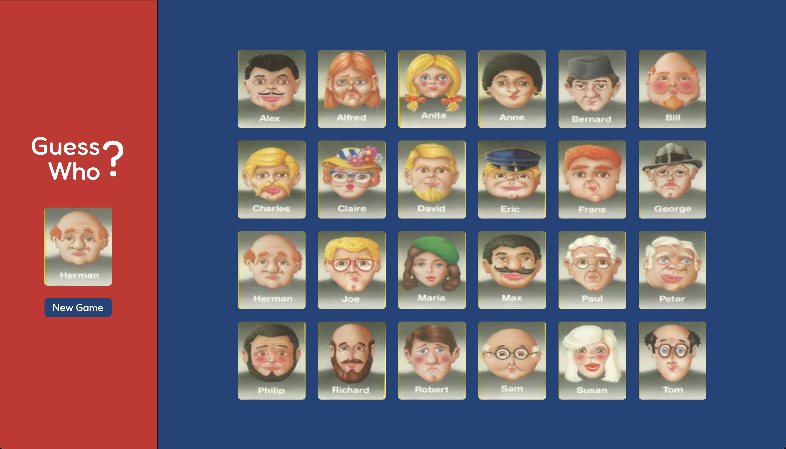

# elm-named-timers

---

Try it out [here](https://main--peaceful-mermaid-d0bf11.netlify.app/)

Grab a friend and play Guess Who against each other on your own computers

---

### Getting Started

Run `npm start` and open up index-watch.html
